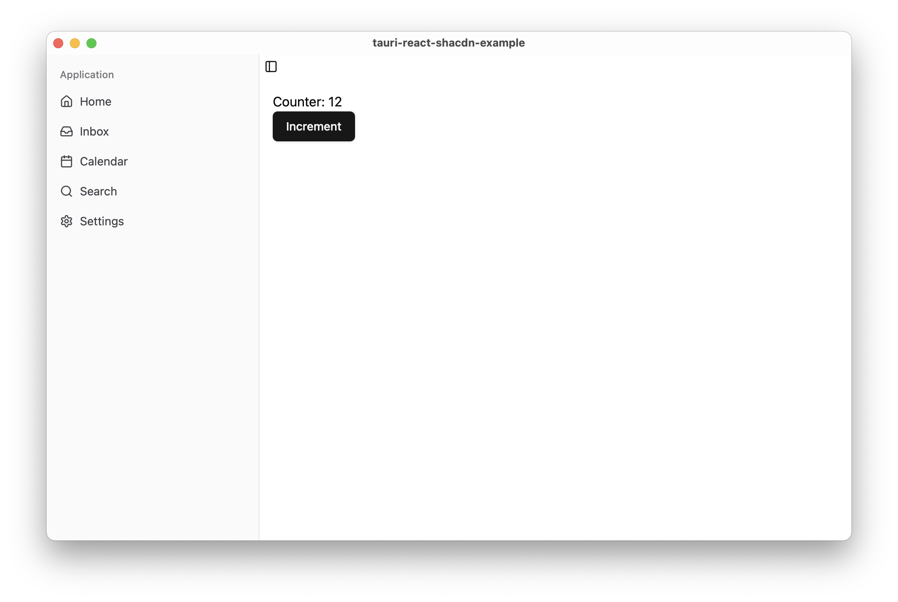

# Tauri + React + Typescript + shadcn Example

This is an example to get started developing with Tauri, React, shadcn and Typescript in Vite.

## Recommended IDE Setup

- [VS Code](https://code.visualstudio.com/) + [Tauri](https://marketplace.visualstudio.com/items?itemName=tauri-apps.tauri-vscode) + [rust-analyzer](https://marketplace.visualstudio.com/items?itemName=rust-lang.rust-analyzer)
